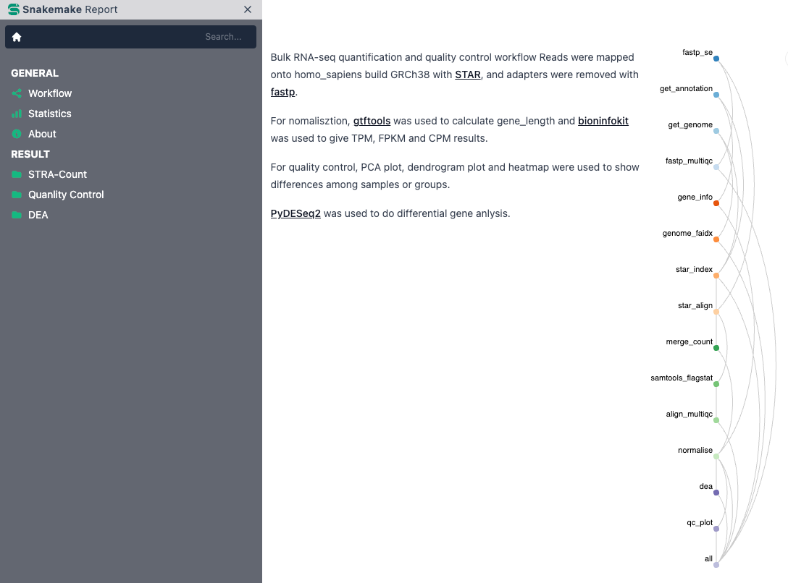
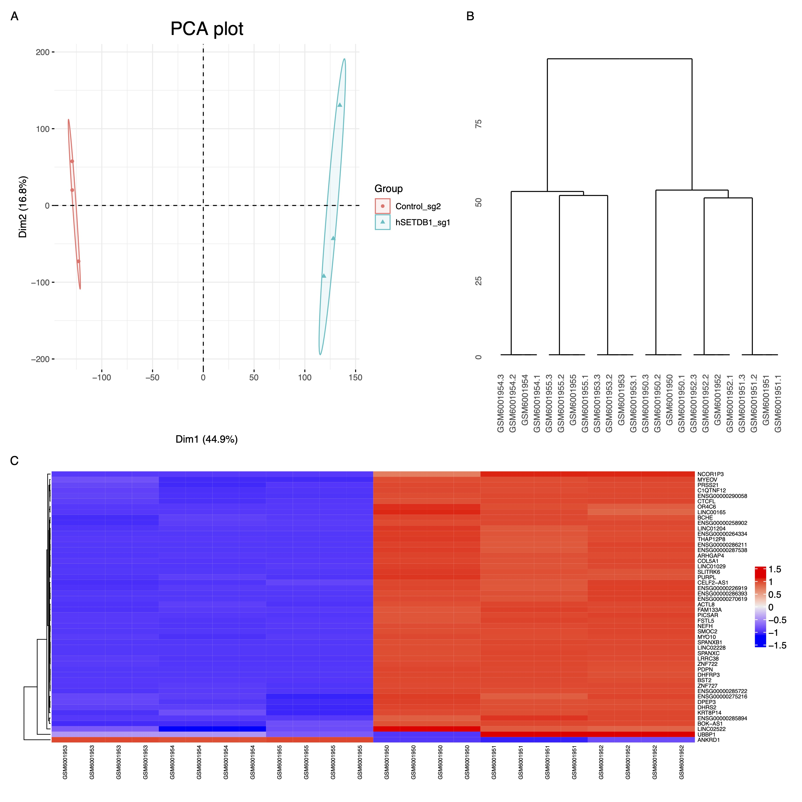
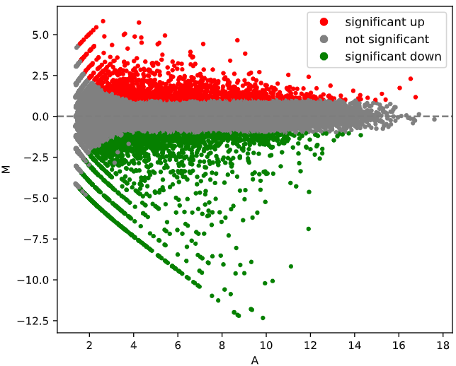
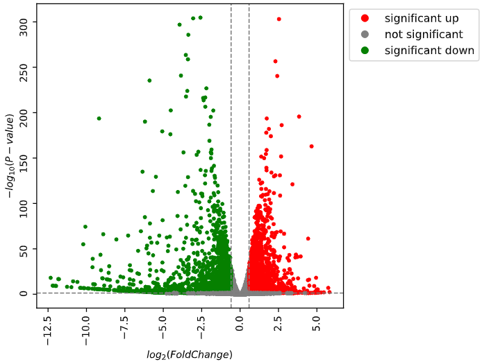

# A SnakeMake workflow for Bulk RNA-seq

Reads were mapped onto homo_sapiens build GRCh38 with STAR, and adapters were removed with fastp.

For nomalisztion, gtftools was used to calculate gene_length and bioninfokit was used to give TPM, FPKM and CPM results.

For quality control, PCA plot, dendrogram plot and heatmap were used to show differences among samples or groups.

PyDESeq2 was used to perform differential expression anlysis.

# General settings
To configure this workflow, modify ``config/config.yaml`` according to your needs, following the explanations provided in the file.

# Sample sheet
* Add samples to `config/samples.tsv`. Only the column `Sample` is mandatory, but any additional columns can be added.
* For each sample, add one or more sequencing units (runs, lanes or replicates) to the `Unit` column of `config/samples.tsv`. 
* For each sample, define `Group` column(experimental or clinical attribute).

# Report

# QC plot

# Differential expression anlysis

## MA plot

## Volcano plot
